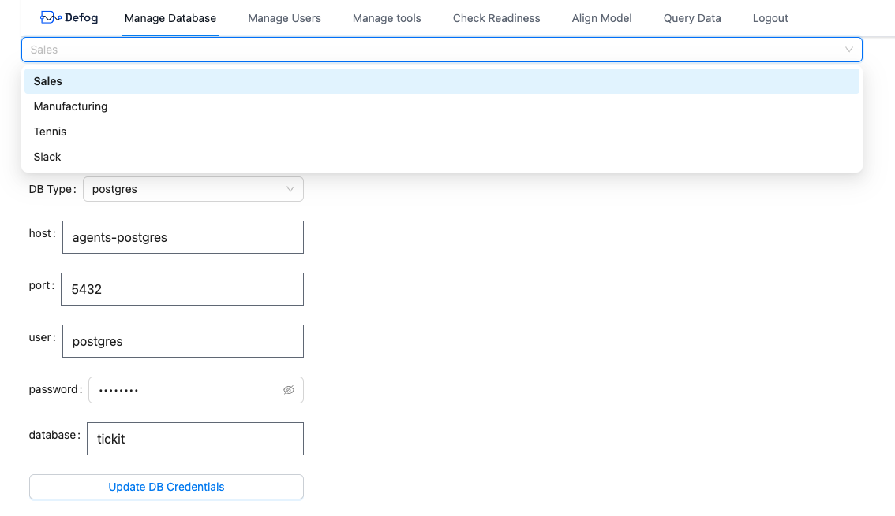

# Defog Docker

Defog Docker is the easiest way to host Defog in a production environment. [defog-desktop](https://github.com/defog-ai/defog-desktop) is great for development and testing, but it's not optimized for production under high load. Defog Docker is a production-ready version of Defog that's easy to deploy and scale.

## Setting up Defog Docker

### Installing Docker
To install Defog Docker, you need to have Docker and Docker Compose installed on your machine. If you don't have them installed, you can follow the instructions on the [Docker website](https://docs.docker.com/get-docker/).

### Cloning this repository
To get started, clone this repository to your local machine:

```bash
git clone https://github.com/defog-ai/defog-docker
cd defog-docker
```

### Obtaining your Defog API Key(s)
If you do not yet have a Defog API Key, sign up at https://defog.ai/signup to get a free one! The free key lets you query up to 5 tables with 25 total columns, and up to 1000 queries per month. If you want to query more complex databases, you can [upgrade to a paid plan](https://defog.ai/pricing).

Once you have Docker and Docker Compose installed, you must update the `.env` file with your `DEFOG_API_KEY` and `DEFOG_API_KEY_NAMES`.

You can use multiple API keys by providing a comma-separated list of API keys. If you do so, then users will be able to select from multiple databases from a UI dropdown, like below



The `DEFOG_API_KEY_NAMES` is a comma-separated list of human readable API key names that you want to display to users. This is to ensure that end-users can easily select the correct API key when querying the database, without you having to expose the actual API key. These can be any string, but should be unique and easily identifiable.

Here is an example of what the `.env` file should look like:

With a single API key:
```bash
DEFOG_API_KEY=YOUR_API_KEY
DEFOG_API_KEY_NAMES="My Dataset"
...
```

With multiple API keys:
```bash
DEFOG_API_KEY=YOUR_API_KEY_1,YOUR_API_KEY_2
DEFOG_API_KEY_NAMES="Dataset 1,Dataset 2"
...
```

## Updating Docker Installation

```bash
# this assumes that we are in the defog-docker folder
# first, we remove the current image and volumes
docker compose rm -f

# then, we pull the latest updates from the docker hub
docker compose pull

# finally, we get the latest image up
docker compose up
```

## Running Defog Docker

To start Defog Docker, run the following command:

```bash
docker compose up
```

To stop Defog Docker, press `Ctrl+C` in the terminal where you ran the `docker compose up` command.

You _might_ see an error the very first time you run `docker compose up`. If this happens, simply exit with `Ctrl+C`, and then run the command again.

If you want to run Defog Docker in the background, you can run the following command:

```bash
docker compose up -d
```
